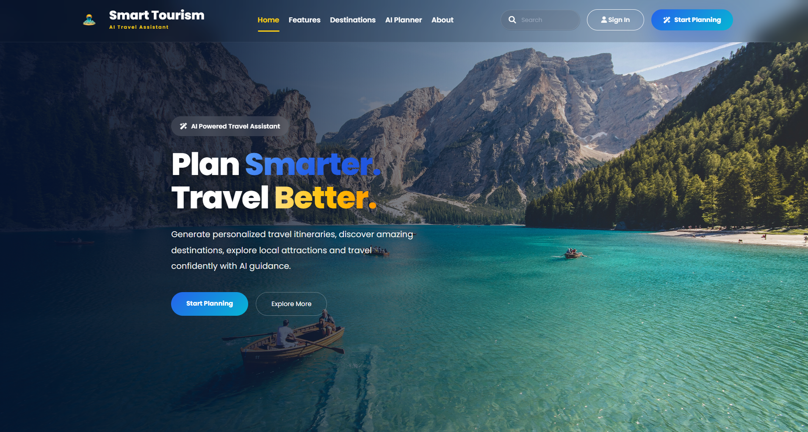

# 🌍 Smart Tourism Planner

An AI-powered tourism planning web application that helps users generate personalized travel itineraries based on their destination, budget, travel duration, interests, and travel type. The application also provides real-time weather information, interactive maps, nearby hotels, restaurants, tourist attractions, and downloadable trip reports.

---

## 📸 Project Preview

> Add screenshots of your application here after uploading them.

| Home Page | Trip Dashboard |
|-----------|----------------|
|  |  |

| Weather & Map | Hotels & Restaurants |
|---------------|----------------------|
|  |  |

---

# ✨ Features

- 🤖 AI-powered personalized trip planning using Google Gemini AI
- 🌤 Real-time weather information using Open-Meteo API
- 🗺 Interactive destination map using Leaflet.js
- 📍 Nearby tourist attractions
- 🏨 Hotel recommendations
- 🍽 Restaurant recommendations
- 💰 Budget estimation
- 📅 Day-wise travel itinerary
- 🎒 Packing checklist
- 🚨 Emergency travel information
- 💡 Travel tips and recommendations
- 📄 Download trip plan as PDF
- 🔒 Secure API key management using `.env`

---

# 🛠 Tech Stack

### Frontend
- HTML5
- CSS3
- Bootstrap 5
- JavaScript
- Leaflet.js

### Backend
- Python
- Flask

### APIs
- Google Gemini AI
- Geoapify API
- Open-Meteo API

### Database
- No database (Current Version)

---

# 📂 Project Structure

```text
SmartTourismPlanner/

│── app.py
│── requirements.txt
│── .env
│── .env.example
│── .gitignore
│
├── services/
│   ├── ai_service.py
│   ├── geocode.py
│   ├── weather.py
│   └── places.py
│
├── static/
│   ├── css/
│   ├── js/
│   └── images/
│
├── templates/
│   ├── base.html
│   └── index.html
│
└── README.md
```

---

# 🚀 Installation

## 1. Clone the repository

```bash
git clone https://github.com//SmartTourismPlanner.git

cd SmartTourismPlanner
```

---

## 2. Create Virtual Environment

### Windows

```bash
python -m venv venv

venv\Scripts\activate
```

### Linux / macOS

```bash
python3 -m venv venv

source venv/bin/activate
```

---

## 3. Install Dependencies

```bash
pip install -r requirements.txt
```

---

## 4. Create `.env`

```env
GEMINI_API_KEY=YOUR_GEMINI_API_KEY

GEOAPIFY_API_KEY=YOUR_GEOAPIFY_API_KEY
```

---

## 5. Run Application

```bash
python app.py
```

Open your browser:

```
http://127.0.0.1:5000
```

---

# ⚙ APIs Used

## Google Gemini AI

Used for:

- AI trip generation
- Personalized recommendations
- Day-wise itinerary
- Budget suggestions
- Travel tips

---

## Geoapify API

Used for:

- Geocoding
- Tourist attractions
- Hotels
- Restaurants
- Interactive destination mapping

---

## Open-Meteo API

Used for:

- Temperature
- Weather condition
- Humidity
- Wind speed
- Sunrise
- Sunset

---

# 📸 Main Modules

- AI Trip Planner
- Weather Dashboard
- Interactive Map
- Nearby Hotels
- Nearby Restaurants
- Tourist Attractions
- Budget Planner
- Packing List
- Emergency Information
- PDF Export

---

# 🔐 Environment Variables

Create a `.env` file in the project root.

```env
GEMINI_API_KEY=YOUR_GEMINI_API_KEY

GEOAPIFY_API_KEY=YOUR_GEOAPIFY_API_KEY
```

Never upload your `.env` file to GitHub.

---

# 🌟 Future Improvements

- User Login & Authentication
- Save Trip History
- Share Trip Plans
- Favorite Destinations
- Multi-language Support
- Currency Converter
- Offline Mode
- Travel Expense Tracker

---

# 🤝 Contributing

Contributions are welcome.

1. Fork the repository
2. Create a feature branch
3. Commit your changes
4. Open a Pull Request

---

# 📄 License

This project is developed for educational and portfolio purposes.

---

# 👨‍💻 Author

**Aniket Prajapati**

- B.Tech Computer Science & Engineering
- Java Backend Developer
- AI & Web Development Enthusiast

---

## ⭐ Support

If you like this project, consider giving it a **⭐ Star** on GitHub.