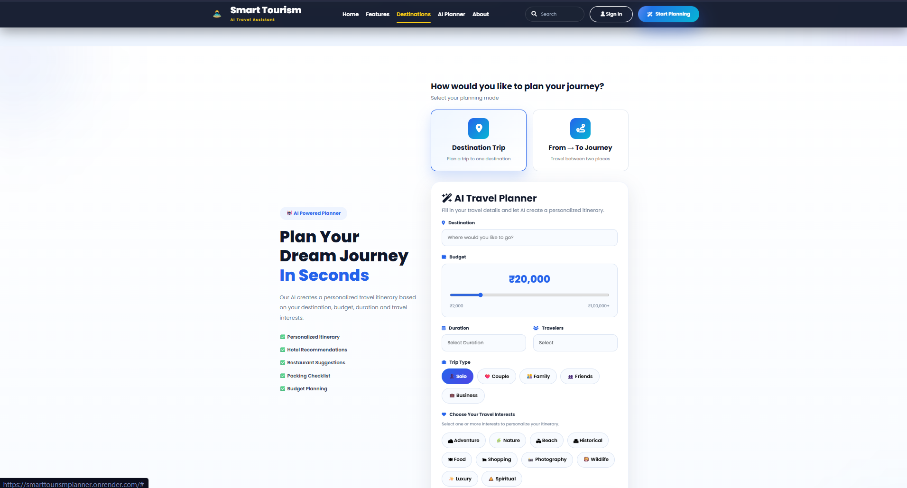
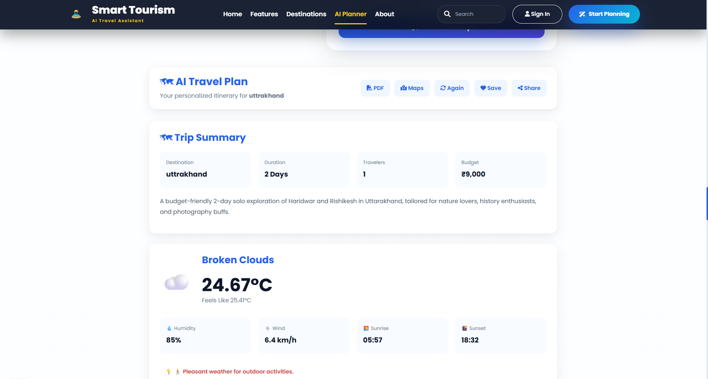
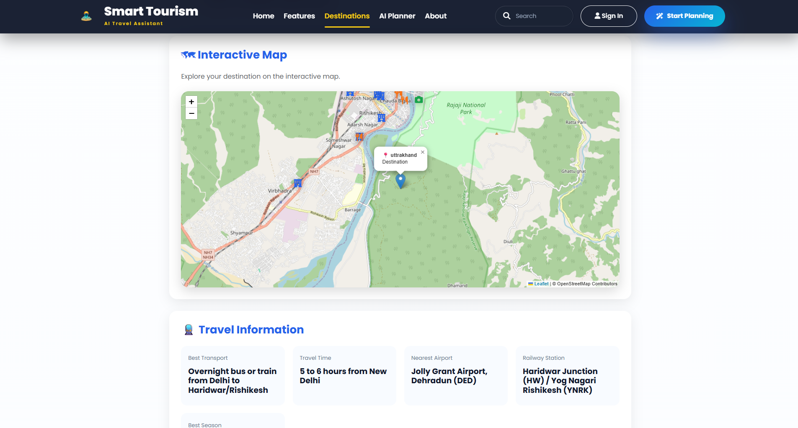

# 🌍 Smart Tourism Planner

An AI-powered travel planning web application that generates personalized travel itineraries based on a user's destination, budget, trip duration, interests, and traveler preferences.

The application combines AI-generated travel recommendations with live weather information, nearby attractions, geocoding, and interactive maps to provide a more convenient travel-planning experience.

**Live Demo:** https://smarttourismplanner.onrender.com
**Repository:** https://github.com/Exploreaniket/SmartTourismPlanner

---

## 📌 Overview

Planning a trip often requires information from multiple sources, including destinations, attractions, weather conditions, maps, and activity recommendations.

**Smart Tourism Planner** brings these requirements together in one application.

Users provide their travel preferences, and the application uses multiple services to generate a personalized travel experience.

The project was built to explore the practical use of **Python, web development, APIs, and AI services** in solving a real-world problem.

---

## 🎯 Problem Statement

Travel planning can become time-consuming when users need to search across different platforms for:

* Places to visit
* Weather conditions
* Nearby attractions
* Suitable activities
* Budget considerations
* Personalized recommendations

There is a need for a simple application that can bring these pieces of information together and help users create a structured travel plan.

---

## 💡 Solution

Smart Tourism Planner provides a single web application where users can enter their travel preferences and receive personalized recommendations.

The application combines:

**User Preferences → AI Recommendations → Travel Information → Personalized Itinerary**

It integrates several external APIs to enrich the generated travel plan with real-time and location-based information.

---

## ✨ Features

### 🤖 AI-Powered Trip Planning

Generates personalized travel itineraries using Google Gemini based on:

* Destination
* Budget
* Number of days
* Travel interests
* Number of travelers
* Trip type

### 🌦️ Live Weather

Provides weather information for the selected destination, including:

* Temperature
* Feels like
* Humidity
* Wind speed
* Sunrise
* Sunset
* Weather description
* Travel advice

### 📍 Nearby Attractions

Finds tourist attractions around the selected destination using location-based services.

### 🗺️ Interactive Map

Displays the selected destination on an interactive map to provide better geographical context.

### 💰 Budget-Based Planning

Uses the user's budget as one of the inputs when generating travel recommendations.

### ❤️ Interest-Based Recommendations

Personalizes recommendations according to the user's selected travel interests.

### 👥 Traveler-Based Recommendations

Considers traveler information when generating the itinerary.

### 🔎 Destination Search

Allows users to search for travel destinations.

### 📱 Responsive Interface

Designed to provide a usable experience across different screen sizes.

---

## 🖥️ Screenshots

> Screenshots will be added here to demonstrate the application interface and major features.

### Home Page


### Trip Planning



### AI Generated Itinerary



### Weather & Attractions


### Interactive Map



> **Note:** Add the corresponding images to a `screenshots/` folder in the repository before publishing these image paths.

---

## 🔄 How It Works

The application follows a simple request-and-response workflow:

```text
User
 │
 │ Travel preferences
 ▼
Frontend
 │
 │ HTTP Request
 ▼
Flask Backend
 │
 ├──────────────► Google Gemini
 │                    │
 │                    ▼
 │              AI Itinerary
 │
 ├──────────────► OpenWeather
 │                    │
 │                    ▼
 │              Weather Data
 │
 ├──────────────► Geoapify Geocoding
 │                    │
 │                    ▼
 │              Location Data
 │
 └──────────────► Geoapify Places
                      │
                      ▼
                Nearby Attractions
 │
 ▼
Personalized Travel Dashboard
```

---

## 🛠️ Tech Stack

### Frontend

* HTML5
* CSS3
* JavaScript

### Backend

* Python
* Flask

### APIs & Services

* Google Gemini API — AI-powered itinerary generation
* OpenWeather API — weather information
* Geoapify Geocoding API — location/geocoding services
* Geoapify Places API — nearby attractions

### Deployment

* GitHub
* Render

---

## 🏗️ Project Architecture

The application separates different external services into individual modules.

```text
Frontend
   │
   ▼
Flask Application
   │
   ├── AI Service
   │      └── Google Gemini API
   │
   ├── Weather Service
   │      └── OpenWeather API
   │
   ├── Geocoding Service
   │      └── Geoapify Geocoding API
   │
   └── Places Service
          └── Geoapify Places API
```

This separation keeps API-specific logic organized instead of placing all external service operations directly inside the main application file.

---

## 📂 Project Structure

```text
SmartTourismPlanner/
│
├── app.py
├── requirements.txt
├── README.md
├── .env.example
├── .gitignore
│
├── services/
│   ├── ai_service.py
│   ├── weather.py
│   ├── geocoding.py
│   └── places.py
│
├── static/
│   ├── css/
│   ├── js/
│   └── images/
│
└── templates/
    ├── base.html
    ├── index.html
    └── dashboard.html
```

---

## ⚙️ Getting Started

### Prerequisites

Make sure you have:

* Python 3.x
* Git
* Required API keys

---

### 1. Clone the Repository

```bash
git clone https://github.com/Exploreaniket/SmartTourismPlanner.git

cd SmartTourismPlanner
```

---

### 2. Create a Virtual Environment

```bash
python -m venv venv
```

Activate the environment.

#### Windows

```bash
venv\Scripts\activate
```

#### Linux / macOS

```bash
source venv/bin/activate
```

---

### 3. Install Dependencies

```bash
pip install -r requirements.txt
```

---

## 🔐 Environment Variables

Create a `.env` file in the project root.

```env
GEMINI_API_KEY=your_gemini_api_key
OPENWEATHER_API_KEY=your_openweather_api_key
GEOAPIFY_API_KEY=your_geoapify_api_key
```

### Required API Keys

| Variable              | Purpose                                |
| --------------------- | -------------------------------------- |
| `GEMINI_API_KEY`      | Generate AI-powered travel itineraries |
| `OPENWEATHER_API_KEY` | Retrieve weather information           |
| `GEOAPIFY_API_KEY`    | Geocoding and nearby places            |

**Never commit your `.env` file or expose API keys publicly.**

---

## ▶️ Run Locally

Start the Flask application:

```bash
python app.py
```

Then open:

```text
http://127.0.0.1:5000
```

---

## ☁️ Deployment

The application is deployed on **Render**.

### Deployment workflow

```text
GitHub Repository
       ↓
Connect Repository to Render
       ↓
Configure Environment Variables
       ↓
Deploy
       ↓
Live Web Application
```

### Live Application

https://smarttourismplanner.onrender.com

---

## 🚀 Future Improvements

Planned improvements include:

* User authentication
* Saving favorite trips
* PDF itinerary export
* Hotel recommendations
* Flight suggestions
* AI travel assistant
* Multi-language support
* Travel expense calculator

---

## 🧠 What I Learned

Through this project, I worked with:

* Python application development
* Flask backend development
* REST API integration
* Working with external API responses
* Environment variable management
* AI API integration
* Frontend and backend communication
* Location-based services
* Building a responsive web application
* Deploying a Python application to the cloud

The project also helped me understand how multiple independent services can be combined into a single real-world application.

---

## 👨‍💻 Author

### Aniket Prajapati

Aspiring Data Scientist interested in **Python, Data Analytics, Data Science, Machine Learning, and practical software development**.

**GitHub:** https://github.com/Exploreaniket

**Project:** https://github.com/Exploreaniket/SmartTourismPlanner

---

## 📄 License

This project was developed for educational and portfolio purposes.

© 2026 Aniket Prajapati. All Rights Reserved.
